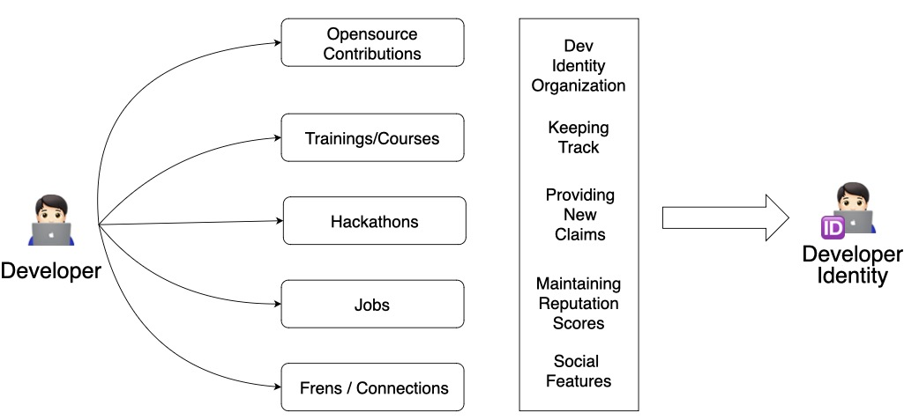
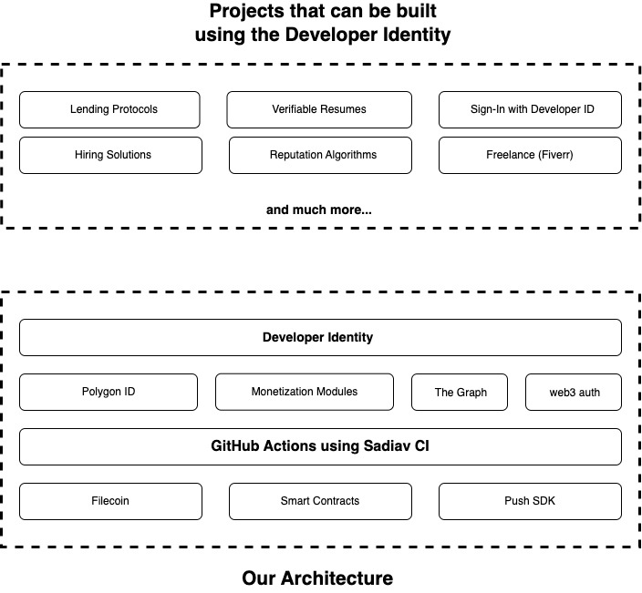

# Developer ID App

Sadaiv ID is a developer Identity app designed to resolve developer's issue of sharing proof of work to employeers, friends and building reputation on-chain while being anonymous.

### **********************Building an on-chain privacy-first verifiable self-soverign developer identity.**********************

### **********************Developers are the core part of web3 ecosystem.**********************

The developer identity is aimed to resolve the issue of developers, as they need to provide their proof of work manually to get jobs, scholarships, opportunities and helping them get a clear reputation metric by collecting their contributions from different platform to blockchain. 

******************************************Multiple dapps can be built on top of this technology, like verifiable resumes, web3 fiverr, etc.******************************************

